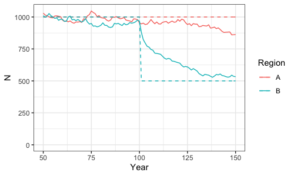
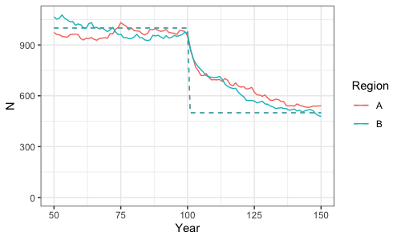

```{r setup, include=FALSE}
knitr::opts_chunk$set(echo = FALSE)

library(knitr)
```

In this project, we are interested in detecting trends in metapopulations of marine mammals where disturbance and sampling may not be uniformly distributed. How should we collect data to maximize the ability to detect declines? We propose to investigate this question using a simulation tool. Briefly, the simulation includes population simulation via a stage-specific population model, data generation via simulated line-transect and capture-recapture surveys, and trend analysis via an integrated population model. In this phase of MSM4PCoD, we plan to simulate a hypothetical population similar to Zc in SoCal as a case study, with the eventual goal of building a framework that could be adapted for any species/region/scenario.

## Task 1: Population Simulation

- The population simulation takes a simple two-box structure. 
- Each "box" represents part of a metapopulation with its own carrying capacity and internal dynamics. 
- The script initPop.R initializes a population, given parameters S0 (calf survival), S1 (juvenile survival), S2 (subadult and adult survival), AFR (age at first reproduction), AJU (age at which become juvenile subject to S1), ASA (age at which become subadult subject to S2), fmax (maximum fecundity), K (carrying capacity), nyears (number of years to run to get stable age dist), and z (degree of compensation).
- projPop.R takes the output of initPop.R and projects the populations forward in time, according to the above parameters plus the number of years to project.
- redistributePop.R then evaluates the ratio of N/K in each of the two population areas and moves individuals (tracked using unique IDs) between areas. Movement of individuals between boxes is allowed when the ratio of N/K is not equal across boxes and only specified age classes can move between boxes.
- The simulation assumes that the animals do not correctly perceive the habitat quality; i.e., N/K is evaluated based on starting K, if K changes, it is assumed that the animals are not responding to this.
- However, population dynamics do respond to the new K.
- This is called an ecological trap.
- Scenarios include a) two stable populations, b) one stable and one decreasing population, and c) two decreasing populations.

```{r, out.width = '75%', fig.align = 'center'}

include_graphics("./Figures/ExScenarioA.png")

```

```{r, out.width = '75%', fig.align='center'}



```

```{r, out.width = '75%', fig.align = 'center'}



```

## Task 2: Survey Simulation

- simCapRecap.R: parameters include survey years, effort (relative to current effort?), and capture probability
- simLineTransect.R: parameters include survey years, effort (relative to current effort?), 
- JS v CJS, think about whether to use the capture recapture data to estimate N and survival?


## Task 3: Model 

- The integrated population model will be written in Nimble. 
- It will take the structure 


## Ideas for Future Expansion

Users could specify study area size and current density (or density surface).
We could include options for a mechanistic (i.e., using life-history parameters to run population models) or empirical (i.e., fixed % change over time) 
The tool could include default settings for different life history types (as in mmrefpoints)
The tool would then allow simulation of data collection using different types of surveys (line-transect, mark-recapture, possibly passive acoustic monitoring) with different intensities. 
Within these eight months, we could simulate a hypothetical population similar to Zc in SoCal as a case study, with the goal of building a framework that can be adapted for any species/region/scenario.

Phase 1: Population model via empirical growth, data generation based on representative CVs, joint trend analysis via log-linear regression

- Parameters include number of regions with respective carrying capacities, intrinsic growth rates, and initial population sizes  
- Disturbed area has new, lower carrying capacity (onset of Navy activities)
- Population model is run forward one year at a time according to the number of animals present in each region plus the growth rate for that region
- After growth, animals are redistributed either evenly across all regions (so density is the same everywhere) OR according to some measure of underlying habitat suitability/attractiveness
- LT suggests not doing habitat suitability unless linked to carrying capacity and/or growth rate
- Could have scenarios where carrying capacity decreases everywhwere, but more dramatic in the disturbed area
- Could introduce environmental variation, fluctuation in carrying capacity from year to year
- TO DO: look into literature on trends being decomposed into environmental variability and measurement error
- Squid fishery or CalCOFI data on variability/fluctuations as indicator of environmental variability? E.g., percentage change in carrying capacity from year to year?
- Ideal density redistribution function (so density is the same everywhere)
- For more complex scenario, might be able to crank up/down migration parameters
- Matthiopoulous 2005 grey seals stochastic movement/migration to new areas, metapopulation 
- How connected are these populations? Connectivity = 1 = ideal free redistribution, connectivity = 0 = isolated
- Work out how many animals would have to leave each region to create even density (set that to 1) then scale that between 0 and 1 (connectivity parameter)
- Could also constrain this so that up to some percentage of individuals are allowed to move (e.g., approx. 8% should be juveniles, only juveniles can move)
- After true population sizes have been simulated in all regions, surveys are simulated
- Sudden change in carrying capacity, might not be much of a trend bc will restabilize
- Play with what the reality is in order to get something even vaguely detectable 

- Could include any number of survey modalities, each with a frequency/inter-survey-interval and CV associated with resulting estimates of abundance, and where it happens
- TO DISCUSS: how to simulate e.g., increasing survey effort (e.g., vary CV according to published CVs for survey and species type?) standard dev scales with square root of effort, so CV will as well
- TO DISCUSS: how to handle surveys that happen only in certain regions
- Could weight by the proportion of the population that they cover (e.g., global survey worth 66 percent and local survey worth 33 percent?) 
- Could split the global survey into strata, only combine information from the overlapping datasets
- Once data collection is simulated, and trend analysis can be conducted with a linear regression, where all datasets share a trend parameter (note could include option to weight different datasets)
- TODO: re-read Charlotte's paper and see how they did inference on local v regional?
- TO DISCUSS: Power is defined as the proportion of simulated populations/datasets/trend analyses that result in detecting a trend of the same direction (e.g., positive or negative?) or should it be more strict?
- Histogram/density plot of estimated trends would be more informative (where power would just be the proportion of those trends that are on the right side of zero)

- Global population abundance estimates, value and CV
- Regional population abundance estiamtes, value and CV
- Trying to follow abundance in each region, model it as two regions, then add together to get global abundance, match with global trend, and match the abundance in one region with 
- Same trend or different trends, wouldn't have a population level trends as a parameter
- Overall trend would be a derived parameter
- State space model with Kalman filter to gets likelihood of obs given params
- Then use maximum likelihood

- Geometric mean of the change in population size? time series is the trend?
- Then look at different effect sizes
- Is the global trend diff from zero, are either regional trends different from zero, 
are the regional trends different from each other
- Maximum likelihood plus error, should be able to come up with an analytic estimate of the 
overall trend parameter
- Power analysis on the probability of detecting a trend in each region
- Could have global trend plus regional? Maybe not Kalman filter-able?
- Global trend plus trend in region 2 could be the two parameters
- Could do a parametric bootstrap to get variance, or numerical derivatives plus Sandwich estimator?

package kf 
Takis Besbeas papers on Kalman filters IPMs, multiple measurements each year or every few years (which is better)

Phase 2: Data generation via stage-specific population model, data generation via simulated surveys, trend analysis via integrated population model

Homework: read Charlotte's paper plus JAGS code, see what we can lose (habitat stuff) minimum simplest scenario, can we lose the individual component of the capture-recapture model?
- Think about whether to do spatial capture recapture?
- JS v CJS, think about whether to use the capture recapture data to estimate N and survival?
- Bias (unmodelled het) causes bias in pop size but not survival

- Parameters include the above minus growth rate plus life-history parameters, which may be the same or different across regions (mmrefpoints, types of life history parameters)
- Stage based beaked whale?
- After growth, juveniles are redistributed across regions
- Surveys are simulated more mechanistically, with animals in fixed points that may or may not be detected by different methods
- Integrated population model utilizes however many data types are collected, with underlying population dynamics model of the same format as used for simulation
- IPM copes with disparity in scales because individuals can move around
- TO DISCUSS: how to incorporate information about age classes in integrated population model, i.e., assume that sampled ratio of juveniles to adults is representative? Something about number of new animals entering the catalog?
- use open population capture recapture, estimate N and survival

- Bayesian version: no burnin or little burnin
- Nimble: can you compile a model before you show it any data? CHECK THIS
- This would make the simulation process faster because you wouldn't need to recompile the model
- Could use TMB
- TMB independence sampler? Importance sampling?

- Question: do we have to embed analyses within nimble or could we send data to Distance/RMark then put outputs into nimble
- Incorporate all into Nimble but try to keep simple, efficient
- Avoid data augmentation, workaround, need to do this more efficiently
- TODO: Look at new IPM book, look into efficient JS

- Non-independence of ratios (juv/adults) and mark-recapture data
- Think about how to handle this in the likelihood
- Can this be built into the likelihood of the capture recapture data, rather than as a separate submodel?
- Minor issue, not a big deal if we don't solve this

- Could start with Charlotte's model, even though simulation process is different
- Could we include line-transect density estimates as processed (analyze with Distance), only the mark-recapture model would be in Nimble
- Could sample distances from a half-normal rather than simulating the locations of individual animals
- It's only in the mark recapture part that we care about who the animals are
- P*N, then pull from half-normal (separately for large and small areas) then add together

- Think about whether there will be enough sightings for distance sampling analysis
- Could add a third box, where animals can't mix but distance sampling still happens
- Want to end up with simulated CVs that are similar to the current CVs from real data

- Poisson/Binomial approximation of the likelihood? 
- Might need to artificially inflate this? Simulate overdispersion. 

- Start by simulating individuals, then build up to groups
- Group size estimation, simulate groups
- Bernoulli for detecting groups, then likelihood for group size that is poisson or neg bin

- Basic thing should run in a few minutes
- Want to avoid following a large population 

- Might need to write your own likelihood for JS? 

- Could extend this to spatial capture recapture

- Could use a much simpler observation process if full IPM is too slow
- Doesn't matter what the data generation process is 

- Lit review 


