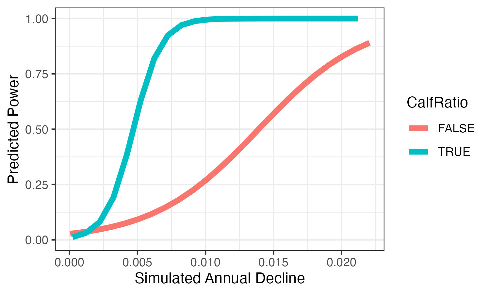
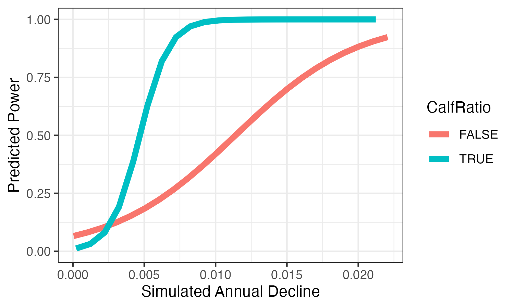
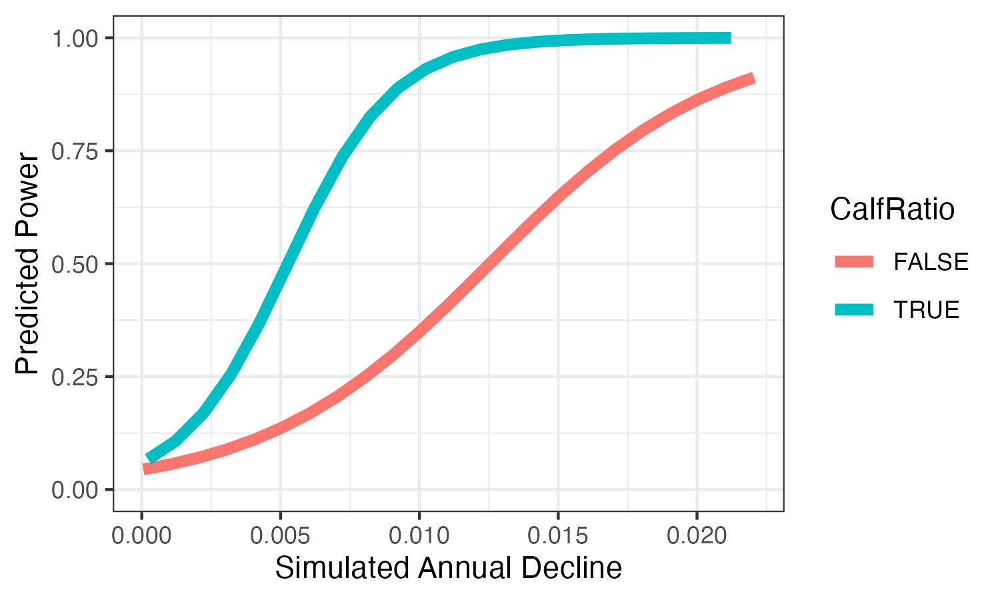

```{r setup, include=FALSE}
knitr::opts_chunk$set(echo = FALSE, message = FALSE)
library(knitr)
source("./Scripts/combinePower.R")
source("./Scripts/plotPower.R")
```

# Does a calf ratio submodel improve power?


```{r, fig.align = "center", out.width = "75%", fig.cap = "Comparison of results from a realistic simualation with and without a calf ratio observational submodel"}




```

\newpage

# Results with calf ratio submodel

## Ideal Scenario

```{r}

type <- "IdealWCalf"
ids <- c("NULL_Ideal_wCalfData_2023-10-10", "D50AB_Ideal_wCalfData_2023-10-12")

for (i in 1:length(ids)){
  plotPower(ids[i])
}

combinePower(ids, type)

load(paste0("./Results/CombinedPower_", type, ".RData"))

kable(tdata, digits = 2)

```

```{r, fig.align = 'center', out.width = '75%', fig.cap = "Predicted power for ideal scenario"}

include_graphics(paste0("./Figures/CombinedPowerPlots_", type, ".png"))
```

\newpage

## 20-yr Ideal

```{r}

type <- "20yrIdealWCalf"
ids <- c("NULL_20yrIdeal_wCalfData_2023-10-20", "D50AB_20yrIdeal_wCalfData_2023-10-23")

for (i in 1:length(ids)){
  plotPower(ids[i])
}

combinePower(ids, type)

load(paste0("./Results/CombinedPower_", type, ".RData"))

kable(tdata, digits = 2)

```

```{r, fig.align = 'center', out.width = '75%', fig.cap = "Predicted power for 20 year ideal scenario"}

include_graphics(paste0("./Figures/CombinedPowerPlots_", type, ".png"))
```

\newpage

## Frequent Surveys Scenario

```{r}

type <- "FreqWCalf"
ids <- c("NULL_Freq_wCalfData_2023-10-12", "D50AB_Freq_wCalfData_2023-10-12")

for (i in 1:length(ids)){
  plotPower(ids[i])
}

combinePower(ids, type)

load(paste0("./Results/CombinedPower_", type, ".RData"))

kable(tdata, digits = 2)

```

```{r, fig.align = 'center', out.width = '75%', fig.cap = "Predicted power for frequent survey scenario"}

include_graphics(paste0("./Figures/CombinedPowerPlots_", type, ".png"))
```

\newpage

## Optimistic Surveys Scenario

```{r}

type <- "OptWCalf"

ids <- c("NULL_Opt_wCalfData_2023-10-10", "D50AB_Opt_wCalfData_2023-10-12")

for (i in 1:length(ids)){
  plotPower(ids[i])
}

combinePower(ids, type)

load(paste0("./Results/CombinedPower_", type, ".RData"))

kable(tdata, digits = 2)

```

```{r, fig.align = 'center', out.width = '75%', fig.cap = "Predicted power for optimistic scenario"}

include_graphics(paste0("./Figures/CombinedPowerPlots_", type, ".png"))
```

\newpage

## Realistic 20-yr Scenario

```{r}

type <- "20yrRealwCalf"
ids <- c("NULL_20yrReal_wCalfData_2023-10-20", "D50AB_20yrReal_wCalfData_2023-10-23")

for (i in 1:length(ids)){
  plotPower(ids[i])
}

combinePower(ids, type)

load(paste0("./Results/CombinedPower_", type, ".RData"))

kable(tdata, digits = 2)

```

```{r, fig.align = 'center', out.width = '75%', fig.cap = "Predicted power for 20 yr realistic scenario"}

include_graphics(paste0("./Figures/CombinedPowerPlots_", type, ".png"))
```

\newpage

# Results from Cormac's Scenarios

## Real Hipcap w/Calf

```{r}

type <- "Real_Hipcap_wCalfData"
ids <- c("NULL_Real_Hipcap_wCalfData_2023-11-02", "D50AB_Real_Hipcap_wCalfData_2023-11-02")

for (i in 1:length(ids)){
  plotPower(ids[i])
}

combinePower(ids, type)

load(paste0("./Results/CombinedPower_", type, ".RData"))

kable(tdata, digits = 2)

```

```{r, fig.align = 'center', out.width = '75%', fig.cap = "Predicted power for hi pcap w/calf scenario"}

include_graphics(paste0("./Figures/CombinedPowerPlots_", type, ".png"))
```

\newpage

## Real Hipcap w/o Calf

```{r}

type <- "Real_Hipcap"
ids <- c("NULL_Real_Hipcap_2023-11-02", "D50AB_Real_Hipcap_2023-11-02")

for (i in 1:length(ids)){
  plotPower(ids[i])
}

combinePower(ids, type)

load(paste0("./Results/CombinedPower_", type, ".RData"))

kable(tdata, digits = 2)

```

```{r, fig.align = 'center', out.width = '75%', fig.cap = "Predicted power for hi pcap w/o calf scenario"}

include_graphics(paste0("./Figures/CombinedPowerPlots_", type, ".png"))
```

\newpage

# Comparison of IPM power for real high pcap scenario with and without calf obs submodel

```{r, fig.align = "center", out.width = "75%", fig.cap = "Comparison of results from a realistic simualation with high pcap with and without a calf ratio observational submodel"}




```
\newpage

## Real Lopcap w/Calf

```{r}

type <- "Real_Lopcap_wCalfData"
ids <- c("NULL_Real_Lopcap_wCalfData_2023-11-05", "D50AB_Real_Lopcap_wCalfData_2023-11-05")

for (i in 1:length(ids)){
  plotPower(ids[i])
}

combinePower(ids, type)

load(paste0("./Results/CombinedPower_", type, ".RData"))

kable(tdata, digits = 2)

```

```{r, fig.align = 'center', out.width = '75%', fig.cap = "Predicted power for low pcap w/calf scenario"}

include_graphics(paste0("./Figures/CombinedPowerPlots_", type, ".png"))
```

\newpage

## Real Lopcap w/o Calf

```{r}

type <- "Real_Lopcap"
ids <- c("NULL_Real_Lopcap_2023-11-05", "D50AB_Real_Lopcap_2023-11-05")

for (i in 1:length(ids)){
  plotPower(ids[i])
}

combinePower(ids, type)

load(paste0("./Results/CombinedPower_", type, ".RData"))

kable(tdata, digits = 2)

```

```{r, fig.align = 'center', out.width = '75%', fig.cap = "Predicted power for lo pcap w/o calf scenario"}

include_graphics(paste0("./Figures/CombinedPowerPlots_", type, ".png"))
```

\newpage

# Comparison of IPM power for real low pcap scenario with and without calf obs submodel

```{r, fig.align = "center", out.width = "75%", fig.cap = "Comparison of results from a realistic simualation with low pcap with and without a calf ratio observational submodel"}




```

\newpage

## 10y_ShBL_EY w/ Calf

```{r}

source("./Scripts/plotPower_IPMOnly.R")
source("./Scripts/combinePower_IPMOnly.R")

type <- "10y_ShBL_EY"
ids <- c("NULL_10y_ShBL_EY_wCalfData_2023-11-05", "D50AB_10y_ShBL_EY_wCalfData_2023-11-05")

for (i in 1:length(ids)){
  plotPower(ids[i])
}

combinePower(ids, type)

load(paste0("./Results/CombinedPower_", type, ".RData"))

kable(tdata, digits = 2)

```

```{r, fig.align = 'center', out.width = '75%', fig.cap = "Predicted power for lo pcap w/o calf scenario"}

include_graphics(paste0("./Figures/CombinedPowerPlots_", type, ".png"))
```

\newpage

## 20y_ShBL_EY w/ Calf

```{r}


type <- "20y_ShBL_EY"
ids <- c("NULL_20y_ShBL_EY_wCalfData_2023-11-05", "D50AB_20y_ShBL_EY_wCalfData_2023-11-05")

for (i in 1:length(ids)){
  plotPower(ids[i])
}

combinePower(ids, type)

load(paste0("./Results/CombinedPower_", type, ".RData"))

kable(tdata, digits = 2)

```

```{r, fig.align = 'center', out.width = '75%', fig.cap = "Predicted power for lo pcap w/o calf scenario"}

include_graphics(paste0("./Figures/CombinedPowerPlots_", type, ".png"))
```

\newpage

## "Actual" w/ Calf

```{r}


type <- "Actual"
ids <- c("NULL_Actual_wCalfData_2023-11-02", "D50AB_Actual_wCalfData_2023-11-02")

for (i in 1:length(ids)){
  plotPower(ids[i])
}

combinePower(ids, type)

load(paste0("./Results/CombinedPower_", type, ".RData"))

kable(tdata, digits = 2)

```

```{r, fig.align = 'center', out.width = '75%', fig.cap = "Predicted power for lo pcap w/o calf scenario"}

include_graphics(paste0("./Figures/CombinedPowerPlots_", type, ".png"))
```

\newpage

## 10 y Low CV EY w/Calf

```{r}

type <- "10yLowCV_EY"
ids <- c("NULL_10yLowCV_EY_wCalfData_2023-11-02", "D50AB_10yLowCV_EY_wCalfData_2023-11-02")

for (i in 1:length(ids)){
  plotPower(ids[i])
}

combinePower(ids, type)

load(paste0("./Results/CombinedPower_", type, ".RData"))

kable(tdata, digits = 2)

```

```{r, fig.align = 'center', out.width = '75%', fig.cap = "Predicted power for 10y low CV EY w/calf scenario"}

include_graphics(paste0("./Figures/CombinedPowerPlots_", type, ".png"))
```

